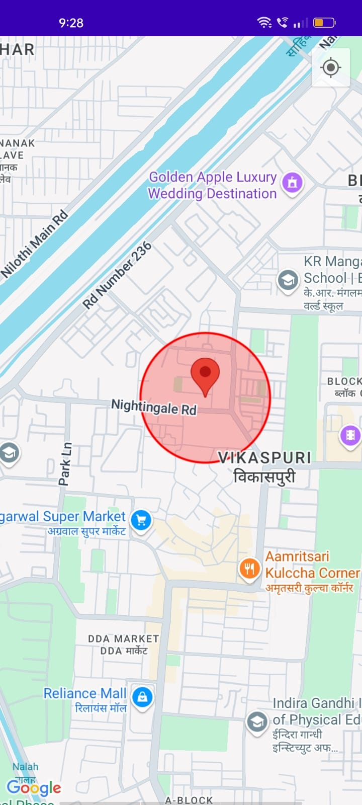

# Guardian Wheels 🚗🔒  
**Guardian Wheels** is an Android-based anti-theft car protection app built with **Kotlin**, leveraging **geofencing technology**. It allows users to set a virtual boundary (geofence) around their car. If the car leaves this boundary, the app triggers an alarm, helping prevent vehicle theft.

---

## Features ✨  
- **Geofencing Technology**: Create a virtual boundary around the car's location.  
- **Real-Time Location Monitoring**: Tracks the car's location using Google Maps API.  
- **Instant Alarm Alerts**: Rings an alarm when the car moves out of the geofence.  
- **Intuitive User Interface**: Simple setup for geofence boundaries and alerts.  

---

## Technologies Used 💻  
- **Programming Language**: Kotlin  
- **Framework**: Android SDK  
- **APIs Used**:  
  - Google Maps API  
  - Location Services  
- **Tools**: Android Studio  

---

## Screenshots 📱   
  

### Setting Up Geofence  
  
